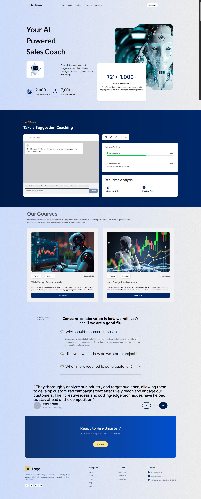

# React + Vite

# SalesRank.AI | Softvence

## Live Demo Links

🚀 [View Live Project: Vercel](https://salesranks-ai.vercel.app/)
🚀 [View Live Project: My Personal Hosting](https://salesranks-ai.eeslah.com/)

## Project Screenshot



## Description

A project of a softvence interview task, where I've to create a perfect clone of the website given by them. And the Live AI section has to be fully functional. I've tried to connect OpenAI, but the api request is not responding. In the future, I'll improve the AI chat system.
For now, there is pre-defined data that will respond when a user tries to chat with the AI.

## Technologies Used

### Frontend

- React.js
- Tailwind CSS
- GSAP Animation
- OpenAI

### Backend

- No backend being used during the project

## 📁 Project Structure

```
 ── src/
    ├── App.jsx
    ├── main.jsx
    ├── index.css
    ├── components/
    │   ├── Counter.jsx
    │   ├── CourseCard.jsx
    │   ├── Cta.jsx
    │   ├── FaqItem.jsx
    │   ├── LiveAICoach.jsx
    │   └── Navbar.jsx
    ├── constants/
    │   └── constant.js
    ├── pages/
    │   └── Page.jsx
    └── sections/
        ├── Course.jsx
        ├── Faq.jsx
        ├── Footer.jsx
        ├── Hero.jsx
        └── Testimonial.jsx
```

- All images assets are in public folder

### Deployment

- Vercel
- GitHub
- Hostinger

## Tools overview

- gsap
- lucide-react
- font awesome icons
- openai
- react-countup
- postcss
- dotenv

## Responsiveness

- Mobile
- Desktop
- tablet 50%

## Key Imports/Dependencies

```json
{
  "name": "salesranks-ai",
  "private": true,
  "version": "0.0.0",
  "type": "module",
  "scripts": {
    "dev": "vite",
    "build": "vite build",
    "lint": "eslint .",
    "preview": "vite preview"
  },
  "dependencies": {
    "@ai-sdk/openai": "^1.3.21",
    "@tailwindcss/postcss": "^4.1.5",
    "@tailwindcss/vite": "^4.1.5",
    "ai": "^4.3.12",
    "dotenv": "^16.5.0",
    "gsap": "^3.13.0",
    "lucide-react": "^0.503.0",
    "openai": "^4.96.2",
    "postcss": "^8.5.3",
    "react": "^19.0.0",
    "react-countup": "^6.5.3",
    "react-dom": "^19.0.0",
    "tailwindcss": "^4.1.5"
  },
  "devDependencies": {
    "@eslint/js": "^9.22.0",
    "@types/react": "^19.0.10",
    "@types/react-dom": "^19.0.4",
    "@vitejs/plugin-react": "^4.3.4",
    "eslint": "^9.22.0",
    "eslint-plugin-react-hooks": "^5.2.0",
    "eslint-plugin-react-refresh": "^0.4.19",
    "globals": "^16.0.0",
    "vite": "^6.3.1"
  }
}


## License

This project is licensed under the MIT License - see the [LICENSE](LICENSE) file for details.
```
